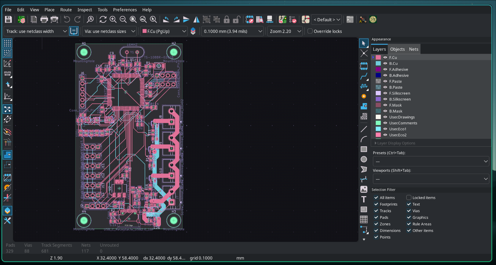
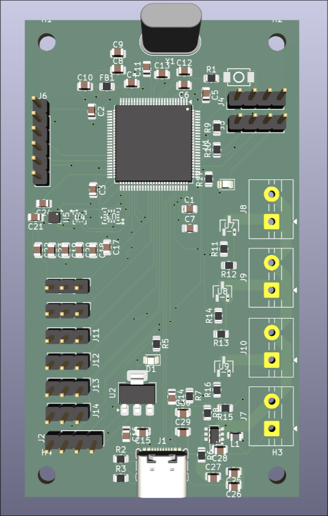
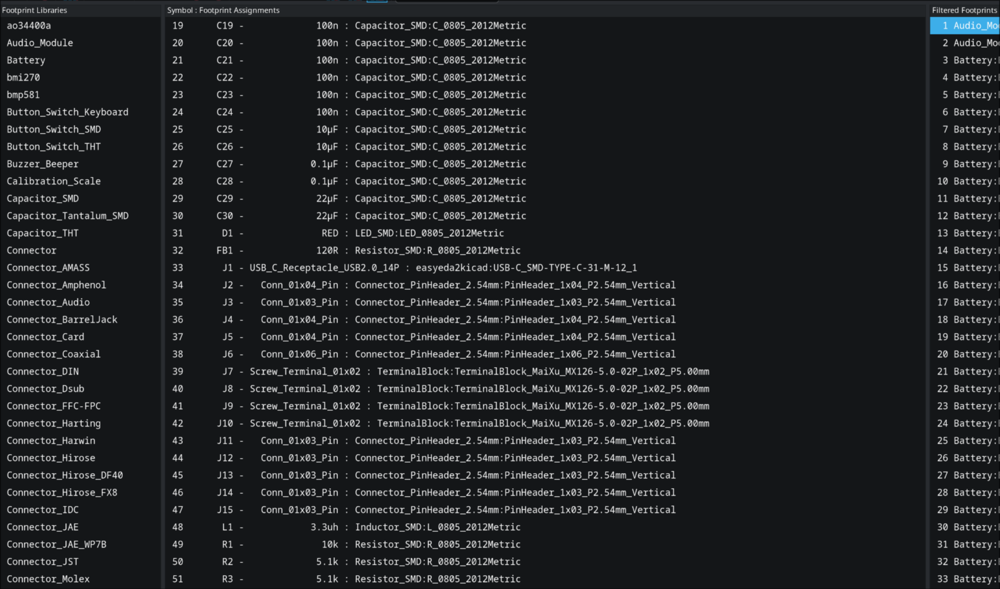
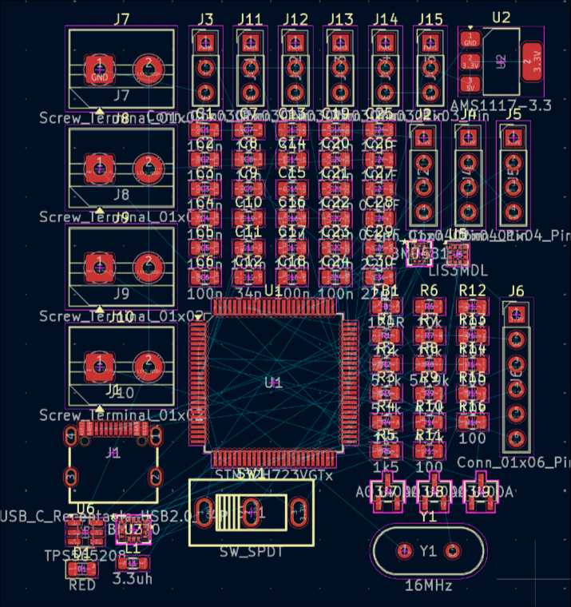
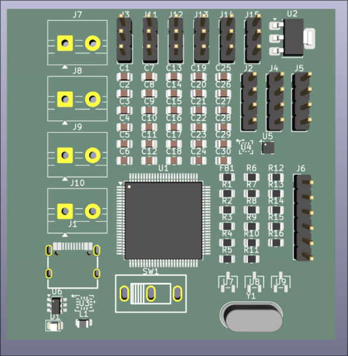
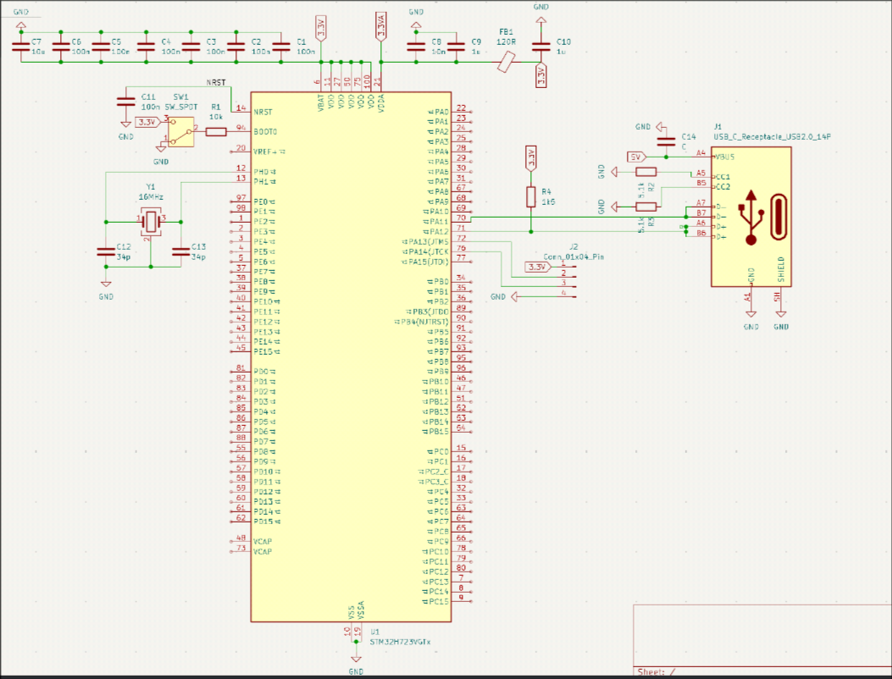
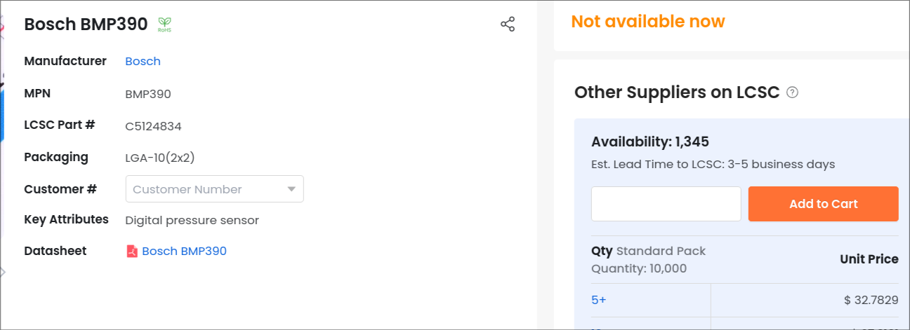
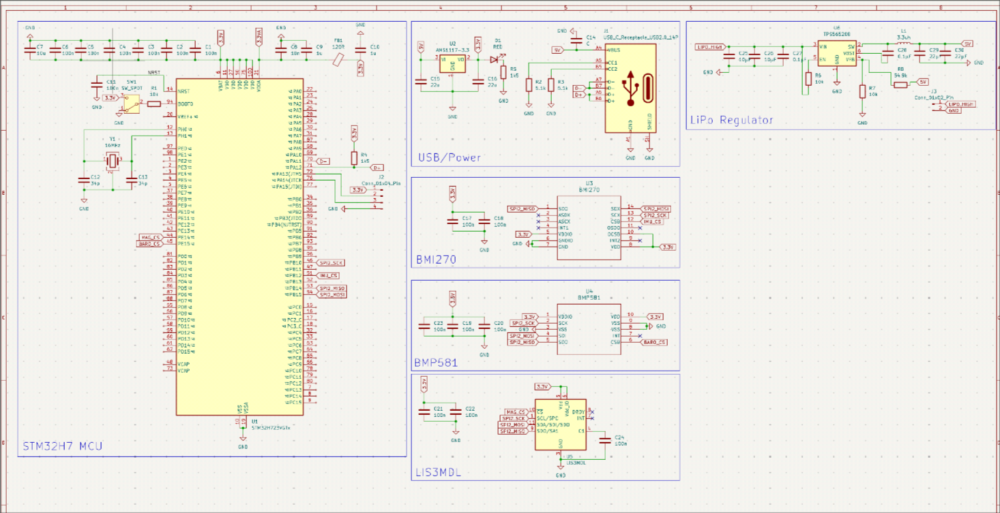

# Journal

## 17 June 2026 - 7 hour
After about 7 hours of work I finally managed to route the entire board. I had to learn a lot. I first began be realizing how bad my current pin choices were.
Often SPI pins were too far apart, or just on the wrong side of the entire MCU. Once I got that down, I had to then go though the pain of placement.
Originally, I began by placing everything, and then trying to route, but that quickly led to issues and a waste of a couple hours. I then pivoted to a mix.

I placed down all large components first, before then adding sensors one by one, along with their decoupling capacitors. Then I setup power.
I had to create large 5V, 3.3V, and GND rails that allowed power to reach all important areas of the entire board, while ensuring to avoid many vias.
After all of this, I ended up with a fairly good board, but had to deal with DRC errors relating to the fact that the footprints of certain Bosch chips are tight.

End result:

I'm really proud of the result. I also asked on Reddit for help on analyzing my work and found no real large issues with the schematic.

## 17 June 2026 - 1 hour
I went through the entire schematic and found footprints for each element. I had to go to LCSC and use a special tool to turn easyeda footprints into KiCad.
Once I was done, I decided to check every footprint visually, and then imported it all into a pcb.

Imported into a pcb:

## 17 June 2026 - 2 hours
I decided to add a ton of GPIO just in case stuff is broken. I added an external SPI bus, an external UART, and an I2C bus.
This should allow for expansion when I acquire a radio and/or a GPS module. I also needed to find a proper N-type MOSFET and wire it correctly.
This is because most rockets need to fire parachute ejection or motor re-light charges mid-flight, which can't be done through GPIO for obvious reasons.
I chose the AOS AO3400A since it had **TONS** of stock.

I then added 6 PWM ports for support for hexacopters, and began analyzing my design to find any obvious faults 

## 17 June 2026 - 3 hours
Other than the Flight Computer, the entire project is, in fact, an autonomous drone.
The goal of the drone is to be able to autonomously travel to GPS coordinates, as well as perform automatic landings using April Tag detection.
This means I have to make a custom flight computer, frame, and fully custom firmware. I hope this project helps me break into the embedded space.

To do this, I need to figure out how drones work specifically. Most drones use BLDC motors, which require specialized controllers (ESCs) to operate.
ESC's are rated by amps, while most drone BLDC motors are rated by KV(RPM / Voltage). I need to find a capable yet affordable pair of these.
Also, Lithium Polymer(LiPo) batteries are typically used to power these setups. They are typically measured in the amount of 3.3V cells (s) and a C rating.
C ratings, when multiplied by the amount of Amp-Hours(Ah) a battery has, yield the maximum safe amount of current they can discharge.

I don't need much power, so a 3S (11.1V nominal) architecture will work fine for now.
I often find people using 1000 kV motors for drones at this scale, so I did the math:

1000 KV * 11.1 V = 11,100 RPM

This sounds pretty promising, but what about the current it draws? Although this is dependent on the load that is driving, typically, people report 15 to 20 amps.
If I purchase 4x 20A ESCs, I'd be drawing about 100 amps, which is a ridiculous number to think about. Assuming a common 3s 120c 2200 mAh battery:

2200 mAh / 1000 = 2.2 Ah
2.2 Ah * 120 C = 264 Amps

264 Amps continuous is more than enough for something like this. It also allows room for upgradability in the future with more power-hungry ESCs and motors.

All this research leads to this current setup:
 - 4x 20A ESC's
 - 1x 3S 2200mAh 120C LiPo battery
 - 4x 1000 KV drone motors
 - 4x Compatible props

Now, I went to try to come up with a cost estimate for such a setup. I started by looking for a LiPo battery.
The best rate I could find that wasn't extremely sketchy was about $28 USD for a kit of two batteries.
Then, for motors, it was really hard to find a **real** rate on Aliexpress. Tons of welcome deals and buy-one-only scams.
The issue is, I can't find anything that isn't a welcome deal. And on top of that, most of those are buy-one-only.
With that being said, at a rate of roughly 20 dollars for a motor+esc kit, that brings the total cost to about $80 USD.
I realize, though, that I can just buy multiple welcome deals to get an extremely cheap setup.

Finally, I looked into Amazon pricing. And to my luck, I found a $32 kit with free shipping that had four motors.

Overall, I'd say the time was well spent doing the research I needed. I plan on 3D printing myself a custom frame using my 3D printer, so that won't be an issue.

## 16 June 2026 - 6 hours
The goal today is to fully complete a schematic of the entire board. I began by updating KiCAD and setting up the MCU.
Importing the STM32H723VGT6 made me realize how large the chip was, as well as the insane amount of pins available.
I've done MCU schematics before, but STM32 is a new world for me, so I began looking for tutorials for STM32 devboards.

In about an hour or so, I got to the point that I had the MCU wired up to the USB-C connector with an external crystal.
I then got a random 5V to 3.3V step-down linear regulator to power the STM32 due to its high supply on LCSC.

I then imported the BMI270 IMU and set up decoupling caps and data signal lines. I had some trouble understanding, as the chip is designed for both I2C and SPI.
I then spent about 20 minutes tidying my design and organizing everything into boxes for more clarity, as well as simplifying unusual wiring.

Then I realized, LCSC doesn't have any stock for the BMP390. Turns out, like always, I ended up with another supply chain issue.

Luckily for me, Bosch has developed a better barometer than the BMP390, the BMP581, which had adequate stock on LCSC.

Finally, for the magnetometer, I decided to switch to the BMM150 thanks to its lower price, and at this rate, all my sensors are made by Bosch.
It should be noted, however, that the BMM150 is discontinued and will never be restocked again. I'm sure this will never become an issue in the future!

Actually, screw that, I'm sticking with the LIS3MDL magnetometer as it's a pretty safe bet. It's also made by ST, so drivers should be easy.

Finally, for the part I'm dreading the most, the TPS56208. It's needed because its job is to allow the flight computer to power on through just LiPo power.
After tons of reading datasheets and careful wiring, I finally finished it. I'm still a bit unsure about it, but I did email TI, and they were helpful last time.

## 15 June 2026 - 4 Hours
The goal of this project is to develop a custom flight computer that can be used for custom autonomous drone and rocket operations.

The first part that I went into was part selection. I need to find a capable MCU, a good Inertial Measurement Unit, and a good barometer.
Another goal of this board is to use parts that are well in stock on both JLC's LCSC, as well as DigiKey's store.
I have had extremely negative situations with IMU and Barometer supply chain issues in the past, and do not wish to repeat these.

MCU selection:
Although in my opinion the best MCUs for performance to dollar are Espressif Systems' ESP32 series, often, due to their large nature, they require expensive PCBA.
When doing research on solutions from other people around the world, the STM32 series from STMicroelectronics always comes up, so I decided to do some research

---

| Family  | Part         | Core       | Max Clock | Flash  | RAM    |
| ------- | ------------ | ---------- | --------- | ------ | ------ |
| STM32F0 | STM32F072C8  | Cortex-M0  | 48 MHz    | 64 KB  | 16 KB  |
| STM32F1 | STM32F103C8  | Cortex-M3  | 72 MHz    | 64 KB  | 20 KB  |
| STM32F3 | STM32F303K8  | Cortex-M4F | 72 MHz    | 64 KB  | 16 KB  |
| STM32F4 | STM32F407VG  | Cortex-M4F | 168 MHz   | 1 MB   | 192 KB |
| STM32F7 | STM32F767ZI  | Cortex-M7  | 216 MHz   | 2 MB   | 512 KB |
| STM32G0 | STM32G071RB  | Cortex-M0+ | 64 MHz    | 128 KB | 36 KB  |
| STM32G4 | STM32G474RE  | Cortex-M4F | 170 MHz   | 512 KB | 128 KB |
| STM32H7 | STM32H743ZI  | Cortex-M7  | 400 MHz   | 2 MB   | 1 MB   |
| STM32L4 | STM32L476RG  | Cortex-M4F | 80 MHz    | 1 MB   | 128 KB |

---

Going through the list, the only two that interest me F7 series and the H7 series for their high performance. 
I decided to go with the STM32H7, but I now needed to select which one based on price, flash size, and clock speed.
After some searching, I found this listing on LCSC:

---
| Series | Core(s) | Max Clock | Flash (max) | RAM | LCSC Price (from) | Representative Part |
|---|---|---|---|---|---|---|
| **STM32H723/733** | M7 | 550 MHz | 1 MB | 564 KB | $6.99 | STM32H723VGT6 |
---

Thanks to the insane clock speed and good pricing, I decided to choose this as my MCU.

IMU selection:
I have used multiple IMU's before, and I have had great issues with finding those that remain stable through multiple vendors.
I've previously used the TDK ICM-42688-P, but due to supply chain issues, I ended up with a useless board with no IMU available. 
Avoiding previous mistakes, I settled on the Bosch BMI270 thanks to its well-documented nature in the world of drones, leading to a steady supply.

Barometer selection:
Barometers are extremely important, and I end up neglecting their selection and using out-of-stock or discontinued sensors, so I decided to be careful.
I decided to go with the Bosch BMP390 this time, thanks to its low noise, good supply chain consistency, and existing drivers for the STM environment

Magnetometer selection:
Although not that important for rocketry, magnetometers are extremely important when performing autonomous navigation in drones.
Following a similar philosophy to the IMU and Barometer solution, I ended up on the LIS3MDL.

Power system:
The STM32H7 chip, as well as most sensors, all run on 3.3V logic, while ESCs and USB typically provide 5V.
I decided to go with the AMS117-3.3 following previous projects, and its well-documented nature.

However, for rockets, I need a proper voltage regulator that can take LiPo input voltage and bring it down to 5 volts.
Following suit with previous designs, I decided to choose the TPS56208 from Texas Instruments.
