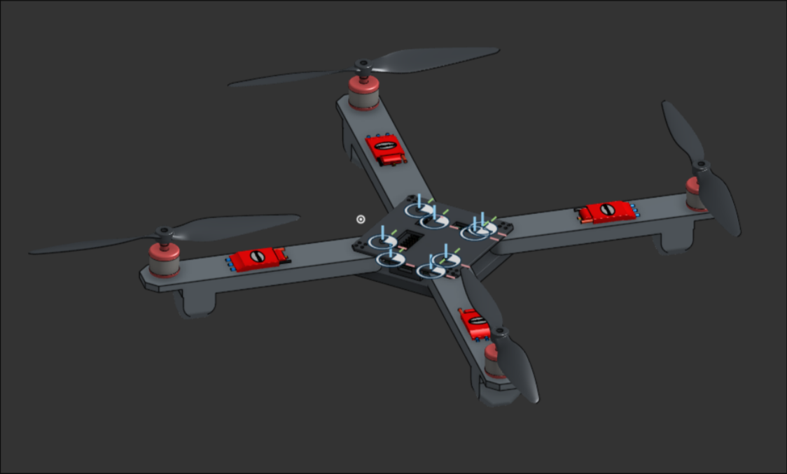

# UltraHawk
A custom fully autonomous drone designed to run custom firmware on a fully custom flight controller. It is capable of autonomously navigating to waypoints.

Ultrahawk utilizes a fully custom PCB made out of SMT components that can be manufactured via a pick-and-place machine, or manually soldered on via hot plate.
You may find KiCAD files in the pcb directory, along with the production folder including a .zip file for easy export to PCB services as JLCPCB and PCBWay.
Components may be found in the `bom.csv` file containing the LCSC part numbers for each part.

UltraHawk also uses a custom frame that is designed to be 3D printed. CAD files for this can be found in the `CAD` folder as `.step` files.

The drone can then be assembled using the rest of the parts such as motors, esc's, and batteries, all of which can be found in the `bom.csv` file.
Perliminary firmware for the project may also be found in the `firmware` directory.

See bom.csv for full price breakdown.
See JOURNAL.md for full work log.

